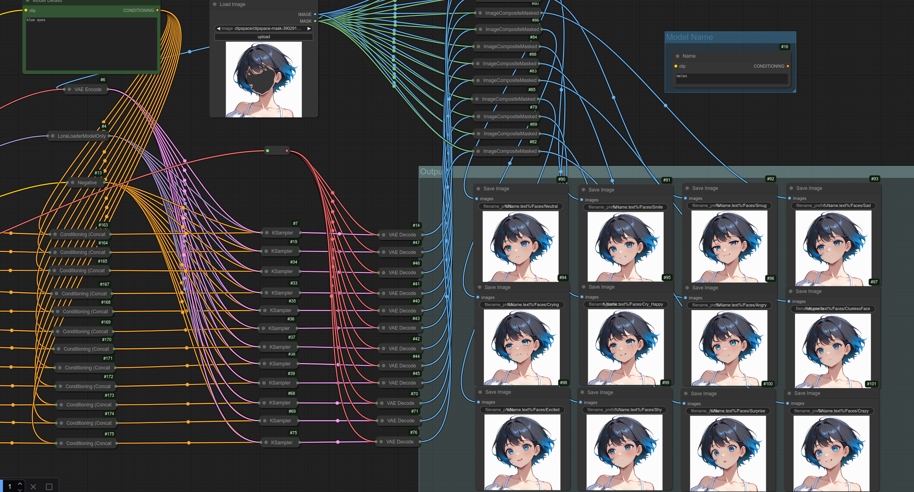
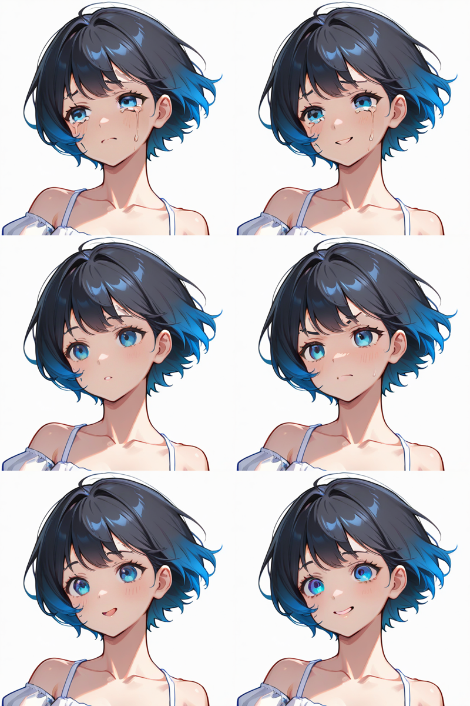

# Face generator

Create different expressions to your model.

## How to use.

* Upload the image.
* Define base model.
* Define mask in face of your model.
* Set output folder name.
* Generate faces.

## Usage

## Result

